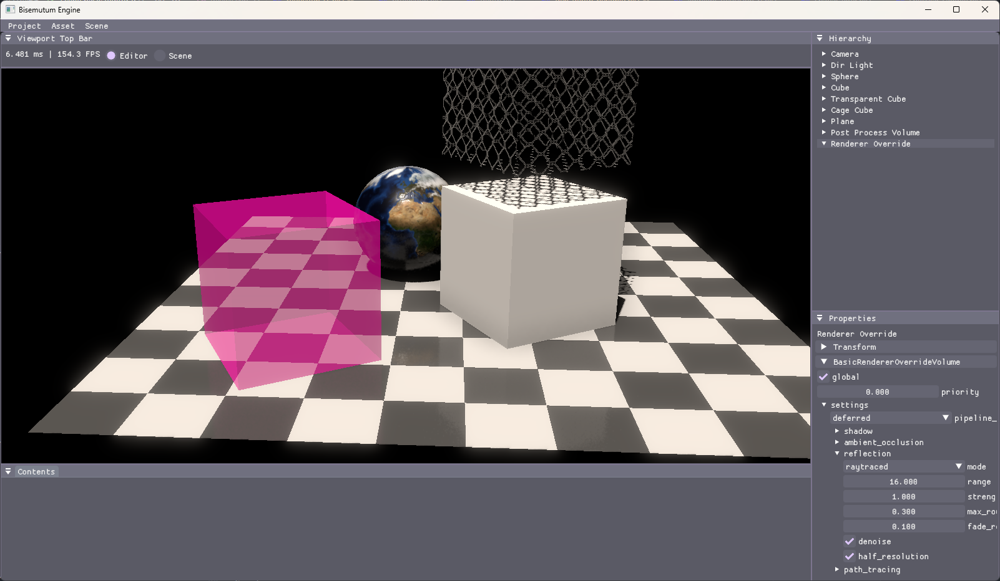

# Bisemutum Engine

WIP very slowly...

My personal renderer using C++20 and modern graphics API (Vulkan and D3D12).

## Features

* Graphics
  * RHI on Vulkan and D3D12
  * ImGui integration on RHI
  * Render graph on RHI
  * SRP-like custom renderer
  * Generate shader resources definition and pipeline layout from C++ structs
* Rendering (the builtin renderer)
  * Basic PBR
  * Forward and deferred rendering
  * Wavefront path tracing
  * CPU frustum culling
  * Cascaded shadow mapping for directional lights; Shadow mapping for point and spot lights (both with PCF)
  * Rect light via LTC (anisotropic GGX)
  * Skybox & IBL
  * SSAO & RTAO
  * RTR
  * Bloom
  * Reverse-Z
* Core
  * Custom static reflection
    * Reflection on `enum` is based on [magic enum](https://github.com/Neargye/magic_enum)
  * Polymorphism using [AnyAny](https://github.com/kelbon/AnyAny)
* Runtime
  * Scene hierarchy
  * Prefab
  * ECS using [EnTT](https://github.com/skypjack/entt)
  * Basic asset manager
  * Basic virtual file system
  * Saving & Loading
* Editor
  * Component editor based on reflection
  * Add or remove scene objects
  * Import textures, models ...

### Features to be Developed Next

* Half resolution RTR & RTAO
* Stochastic screen space reflection
* Basic material editor
* Basic resource browser

## Gallary

Path traced Sponza

Raytraced reflection

## Build

This project uses [Xmake](https://xmake.io/) to build.

On Windows, clang-cl is preferred.

## Used Thirdparty

Core

* [AnyAny](https://github.com/kelbon/AnyAny) (Apache-2.0) (in source)
* [magic enum](https://github.com/Neargye/magic_enum) (MIT)
* [fmt](https://github.com/fmtlib/fmt) ([LICENSE](https://github.com/fmtlib/fmt/blob/master/LICENSE))
* [GLM](https://github.com/g-truc/glm) (MIT)
* [miniz](https://github.com/richgel999/miniz) (MIT)

Runtime

* [EnTT](https://github.com/skypjack/entt) (MIT)
* [spdlog](https://github.com/gabime/spdlog) (MIT)

Graphics

* [volk](https://github.com/zeux/volk) (MIT) (in source)
* [Vulkan Memory Allocator](https://github.com/GPUOpen-LibrariesAndSDKs/VulkanMemoryAllocator) (MIT)
* [D3D12 Memory Allocator](https://github.com/GPUOpen-LibrariesAndSDKs/D3D12MemoryAllocator) (MIT)
* [pep-cprep](https://github.com/PepcyCh/pep-cprep) (MIT) (in source)
  * This is a macro and include preprocesser for C-like language, and is also written by myself.
* [DirectXShaderCompiler](https://github.com/microsoft/DirectXShaderCompiler) ([LICENSE](https://github.com/microsoft/DirectXShaderCompiler/blob/main/LICENSE.TXT))

Window

* [GLFW](https://github.com/glfw/glfw) (zlib)

Editor

* [Dear ImGui](https://github.com/ocornut/imgui) (MIT)
* [ImGui File Dialog](https://github.com/aiekick/ImGuiFileDialog) (MIT) (in source)

Asset

* [stb](https://github.com/nothings/stb) (MIT)
* [tinyexr](https://github.com/syoyo/tinyexr) (BSD-3)
* [tinygltf](https://github.com/syoyo/tinygltf) (MIT)
* [assimp](https://github.com/assimp/assimp) ([LICENSE](https://github.com/assimp/assimp/blob/master/LICENSE))

Misc

* [crypto algorithms](https://github.com/KorewaWatchful/crypto-algorithms)
* [mikktspace](https://github.com/mmikk/MikkTSpace)
* [nlohmann json](https://github.com/nlohmann/json) (MIT)
* [toml++](https://github.com/marzer/tomlplusplus) (MIT)

